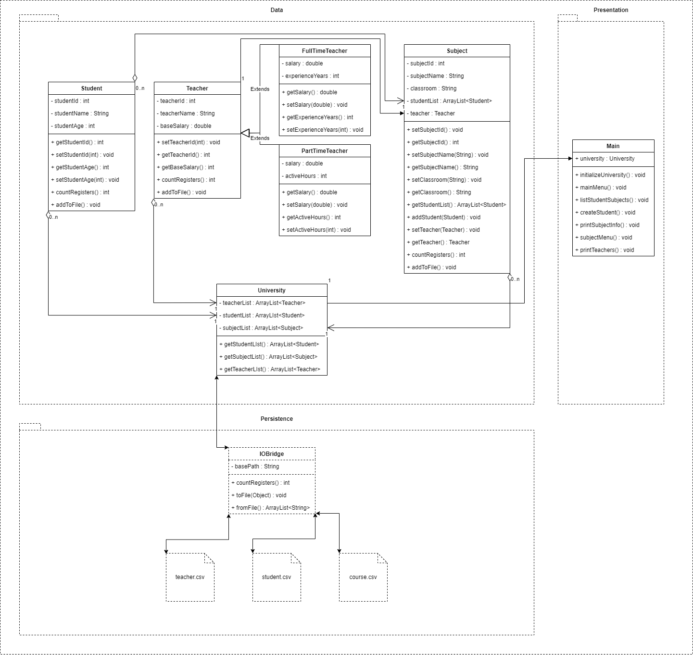

## University Tracker

I want to make a system to track my university classes, teachers and students. Each Teacher has a name, and
a salary calculated by the following rules:
- For the full time teachers: base salary (attribute) multiplied by 110% of its experience years.
- For part-time teachers: base salary multiplied for its active hours per week.

The university includes a list of teachers, a list of students and a list of classes. Each class has a name, an
assigned classroom, a list of students and a teacher. Every student has his name, id, and age.
The program should:

1. Initialize minimum 2 different teachers of each type (full time, part time).
2. Initialize minimum 6 different students
3. Initialize minimum 4 different classes including its teacher , students and other relevant data
4. Print a menú including the following options:

   - Print all the professors with its data
   - Print all the classes and a submenu to select a class in order to print the class data including its teacher and students
   - Create a new student and add it to an existing class
   - Create a new class and add an existing teacher, existing students and its relevant data
   - List all the classes in which a given student is included (hint: search by id)
   - Exit

### Rules:
- The project must be uploaded to a new public github repository, which should be public. The repository
  should include appropriate use of .gitIgnore, more than one branch, and multiple commits.

### UML Diagram

### Notes
The persistence layer contains csv files from where the initial data is read and to where the new data is written during 
program execution. For practical purposes the IOBridge class contains a full path named accordingly to the local developement
environment and will need to be replaced in order to work at another machine.